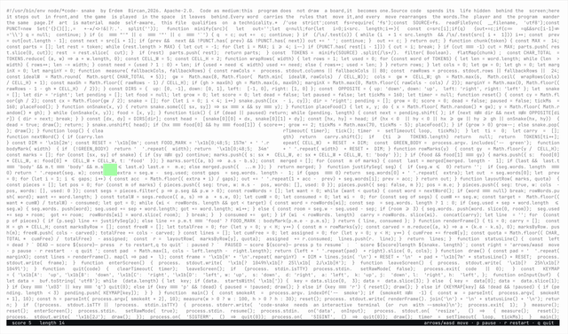

# code-snake

Snake, played inside the program's own source code. **The code is the board.**

<p align="center">
  
</p>

No sprites, no box-drawing characters, no pixels. When code-snake starts, it reads
its own source file, minifies it, and lays it out as fully justified text filling
an exact rectangle. The snake exists only as *absence*: words are pushed together
and apart every frame so that a channel of whitespace moves through the live code.
Eat, and the program's text makes room for you.

## Code as medium

Most programs treat their source as an implementation detail, the thing you look
at only when something breaks. Here the source is the material itself: the canvas,
the playfield, and the collision geometry are all the same bytes that implement
them. Edit the code and the board changes, because the board *is* the code.

This is not a quine. The program never reproduces itself; it consumes itself,
reflowing its own text around the game state as you play.

## Run

```sh
npx code-snake
```

That is the whole install. npx fetches the package, runs it, and leaves nothing behind.

To keep it around:

```sh
npm install -g code-snake
code-snake
```

Or, from a clone of this repo:

```sh
node snake.js
```

Requires an interactive terminal and Node.js 14 or newer. No dependencies.

| Keys | |
|---|---|
| arrows / `wasd` / `hjkl` | move |
| `p` | pause |
| `r` | restart |
| `q` / `Ctrl-C` | quit |

### Flags

| Flag | Effect |
|---|---|
| `--green` | paint the snake body green instead of pure whitespace |
| `--smoke [cols rows]` | render a single frame headless and exit (testing) |

## Changelog

Release history lives in [CHANGELOG.md](CHANGELOG.md).

